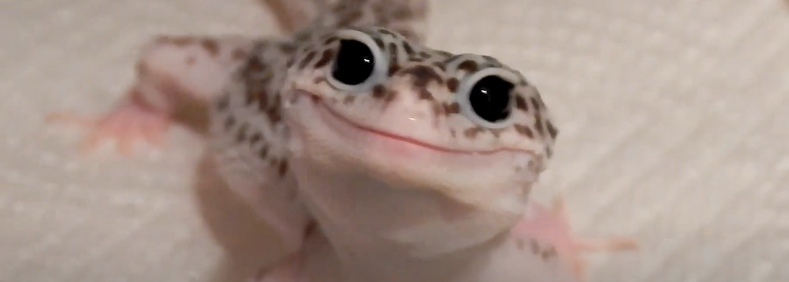

<h1 align="center">Hello world</h1>

<!--
**daneuse07/daneuse07** is a ✨ _special_ ✨ repository because its `README.md` (this file) appears on your GitHub profile.

Here are some ideas to get you started:
-->
<ul>
  <li>Tengo 18 años</li>
  <li>Desempleada oficial</li>
  <li>Jazmín es terraplanista</li>
</ul>
